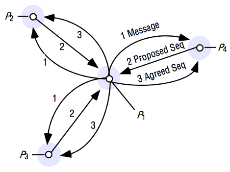
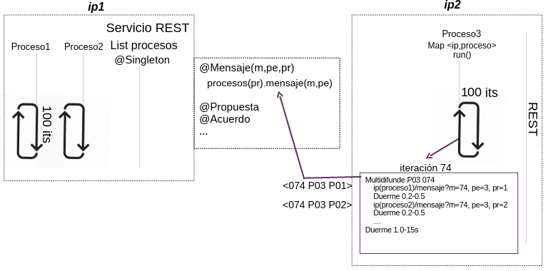

# ISIS-REST-In-Chaos
Distributed multicast algorithm with total ordering similar to that used in the ISIS system

  

## Design
The practice consists of 6 Java processes on three different nodes (2 processes per machine). To do this, a server is launched per machine that contains the 2 processes and 'dispatches' each one according to an argument. In addition, all processes are deployed on all machines from a single node, automatically.

  

